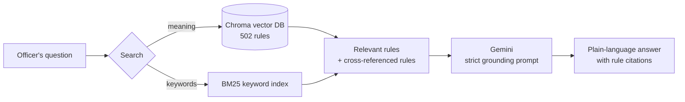

# PSR Assistant

An AI assistant that explains Nigeria's **Public Service Rules (PSR), 2021 Edition** to government workers in plain language. Every answer is grounded in the actual rule text and cites the rule number, so officers can check it with HR or their supervisor.

> "Can I take casual leave and annual leave together?" · "What happens if I'm given a query?" · "Wetin go happen if I no come work for one week?"

The assistant finds the relevant rules, then explains them in a fixed, easy-to-follow structure. It answers in English, Nigerian Pidgin, Yoruba, Hausa or Igbo, depending on the language of the question.

---

## Contents

- [How it works](#how-it-works)
- [Features](#features)
- [Project structure](#project-structure)
- [Setup](#setup)
- [Usage](#usage)
- [API reference](#api-reference)
- [Testing and evaluation](#testing-and-evaluation)
- [Configuration](#configuration)
- [Design decisions](#design-decisions)
- [Limitations](#limitations)
- [Roadmap](#roadmap)
- [Copyright notice](#copyright-notice)

---

## How it works

The assistant uses **retrieval-augmented generation (RAG)**. The language model is not trained on the PSR. Instead, for each question it is handed the exact rules that apply and is instructed to explain only those.



1. **Parsing.** The PSR document is split into 502 records, one per rule, using its six-digit numbering (`120203` = Chapter 12, Section 02, Rule 03). Each record keeps its chapter and section name. Chapter 18 and the appendices, which have no rule numbers, are split into short chunks.
2. **Cleaning.** Leftovers from the scanned source (margin headings, page headers, misread list numbering such as `(7)` for `(i)`) are removed from the text the model reads.
3. **Indexing.** Each rule is embedded with `gemini-embedding-001` and stored in a local Chroma database. This happens once.
4. **Retrieval.** Each question runs through two searches that complement each other:
   - *Meaning search* (embeddings) finds rules that match the intent, even in Pidgin or everyday wording.
   - *Keyword search* (BM25) finds exact terms like "maternity" or "suspended". Long rules are searched clause by clause, so one relevant clause inside a long rule isn't missed.
   - Rules referenced by the retrieved rules (e.g. "in accordance with Rule 100406") are added automatically.
5. **Answering.** Gemini receives the question and the rule text, with instructions to use only those rules, cite rule numbers, keep conditions and the officer's protections, never invent steps or numbers, and say so when it can't find something.

## Features

- **Grounded answers.** Every fact comes from the rule text, with rule numbers cited.
- **Consistent structure.** Each answer has the sections *In simple terms*, *Example*, *What you should do*, *The rule says* and *Related rules*.
- **Audience levels.** `simple` for new or junior officers, `standard`, and `detailed` for senior officers and HR staff.
- **Multilingual.** Replies in the language of the question, including Nigerian Pidgin.
- **Honest about gaps.** When the retrieved rules don't cover something, it says so and refers the officer to their HR/Establishment department instead of guessing.
- **Conversation memory.** Follow-up questions ("What if I'm on GL 05?") use the last few exchanges.
- **Resilient.** Retries automatically when Gemini is busy, rate-limited or the connection drops, and falls back to a lighter model if needed.
- **Built-in evaluation.** A 29-question test set checks both search accuracy and answer quality.

## Project structure

```
psr-assistant/
├── data/
│   ├── psr.md                 # Text extracted from the PSR 2021 document
│   ├── psr_rules.json         # 502 parsed rules (raw text + cleaned text)
│   ├── test_questions.json    # Evaluation questions with verified expected rules
│   └── chroma/                # Vector database (generated, not committed)
├── results/                   # Evaluation outputs (generated, not committed)
│
├── parse_psr.py      # Step 1: split the PSR text into rule records
├── clean_rules.py    # Step 2: clean scanning artefacts from the rule text
├── ingest.py         # Step 3: embed the rules into Chroma (resumable)
├── rag.py            # Retrieval + answer generation (the core)
├── ask.py            # Chat with the assistant in the terminal
├── main.py           # FastAPI web service
├── evaluate.py       # Retrieval and answer evaluation
├── setup_key.py      # Saves and verifies your Gemini API key
├── check_key.py      # API-key diagnostics
├── requirements.txt
└── .env.example
```

## Setup

### Requirements

- Python 3.10 or newer
- A Gemini API key from [Google AI Studio](https://aistudio.google.com) (the free tier is enough for development)

### 1. Install

```bash
git clone https://github.com/mrolaleyepaul/psr-assistant.git
cd psr-assistant

# Option A: conda
conda create -n psr python=3.11 -y
conda activate psr

# Option B: venv (Windows)
python -m venv venv
venv\Scripts\activate

pip install -r requirements.txt
```

### 2. Add your API key

```bash
python setup_key.py
```

This asks for the key (input is hidden), writes it to `.env`, and confirms that Google accepts it. `.env` is excluded from Git, so the key is never committed.

### 3. Build the database

```bash
python ingest.py
```

This embeds all 502 rules and takes a few minutes. It is safe to interrupt: running it again continues where it stopped. Use `python ingest.py --rebuild` only to start over from scratch.

> The parsed and cleaned rules are already included in `data/psr_rules.json`. You only need `parse_psr.py` and `clean_rules.py` if the source document changes.

## Usage

### Terminal chat

```bash
python ask.py
```

Choose an audience level, then ask questions. Type `exit` to quit.

### Web API

```bash
uvicorn main:app --reload
```

Interactive docs are at http://127.0.0.1:8000/docs.

### From Python

```python
from rag import answer

result = answer("How much maternity leave can a female officer take?", audience="simple")
print(result["answer"])
print(result["sources"])   # IDs of the rules that were retrieved
```

## API reference

### `POST /ask`

**Request**

```json
{
  "question": "Can I take casual leave before my annual leave?",
  "history": [
    {"role": "user", "text": "How many days of casual leave can I take?"},
    {"role": "model", "text": "...previous answer..."}
  ],
  "audience": "standard"
}
```

| Field | Type | Required | Description |
|---|---|---|---|
| `question` | string | yes | The officer's question, in any supported language |
| `history` | array | no | Previous turns, each `{role: "user" \| "model", text}`. The last 6 are used. |
| `audience` | string | no | `simple`, `standard` (default) or `detailed` |

**Response**

```json
{
  "answer": "**In simple terms** - ...",
  "sources": ["120214", "120215", "120206"]
}
```

`answer` is Markdown. `sources` lists the rules retrieved for the question.

### `GET /health`

Returns `{"ok": true}`, for uptime checks.

## Testing and evaluation

`data/test_questions.json` holds 29 realistic officer questions covering leave, discipline, conduct, retirement, probation, allowances, petitions and virtual meetings, plus one in Pidgin. Each question lists the rule(s) that should answer it, verified against the PSR.

```bash
python evaluate.py            # search test (1 Gemini call per question)
python evaluate.py --answers  # also writes every full answer to results/answers.md
```

**Current search result: 29/29.** The correct rule is retrieved for every test question.

Answers are cached in `results/answers_cache.json`, so an interrupted run continues without repeating Gemini calls. Delete that file to regenerate all answers after changing the prompt or retrieval.

Answer quality is reviewed manually against the rules, checking for factual accuracy, invented steps or numbers, dropped conditions, rules applied out of context, and clarity.

## Configuration

Settings live in `.env`:

| Variable | Default | Purpose |
|---|---|---|
| `GEMINI_API_KEY` | (none) | Your Gemini API key (required) |
| `CHAT_MODEL` | `gemini-2.5-flash` | Model that writes the answers |
| `FALLBACK_MODEL` | `gemini-2.5-flash-lite` | Used when the main model is overloaded |
| `EMBED_MODEL` | `gemini-embedding-001` | Embedding model for search |

### Quotas

On Gemini's free tier, each question costs two calls (one embedding, one answer), and quotas are shared across the whole Google project. The free tier suits development and small pilots. A production deployment for many officers should use a paid key owned by the deploying organisation, which also keeps request data out of Google's product-improvement use.

## Design decisions

- **RAG instead of fine-tuning.** Fine-tuned models are poor at recalling exact figures and can't reliably cite sources. With RAG, the exact rule text is in front of the model for every answer, rule updates only require re-indexing, and citations are traceable.
- **Hybrid search.** Embeddings handle meaning and informal language; keyword search catches exact terms and specific clauses inside long rules. Each covers the other's weak spots.
- **Excerpts for long rules.** The longest rules (e.g. Rule 100307, the dismissal procedure) are sent as focused excerpts of the clauses that match the question, so key sentences aren't buried.
- **Section context.** Each rule carries its chapter and section name, so rules for special groups (e.g. non-pensionable appointments) aren't presented as applying to everyone.

## Limitations

- **Scanned source.** The PSR text was extracted from a scanned copy. Cleaning removes most artefacts, but some OCR errors remain, and a few rule numbers were misread in the source.
- **Circulars.** Rules may have been updated by circulars issued after the 2021 edition. Every answer reminds the officer of this.
- **Not legal advice.** The assistant is a guide. Decisions on discipline, entitlements or appointments should be confirmed with the relevant HR/Establishment department.
- **Chapter 18 and appendices** have no rule numbers and are cited by chapter.

## Roadmap

- [x] Parse and index the PSR 2021
- [x] Hybrid retrieval with cross-references
- [x] Grounding prompt with structured, audience-aware answers
- [x] Evaluation set and answer review
- [ ] Web chat interface for officers
- [ ] WhatsApp channel
- [ ] Optional self-hosted model (Ollama) for fully offline deployment
- [ ] Deployment

## Copyright notice

The Public Service Rules are © Office of the Head of the Civil Service of the Federation (OHCSF). This repository contains text derived from the PSR for the purpose of building the assistant. Obtain the appropriate approval before any public release.

## Author

**Paul Olaleye** · [@mrolaleyepaul](https://github.com/mrolaleyepaul)
